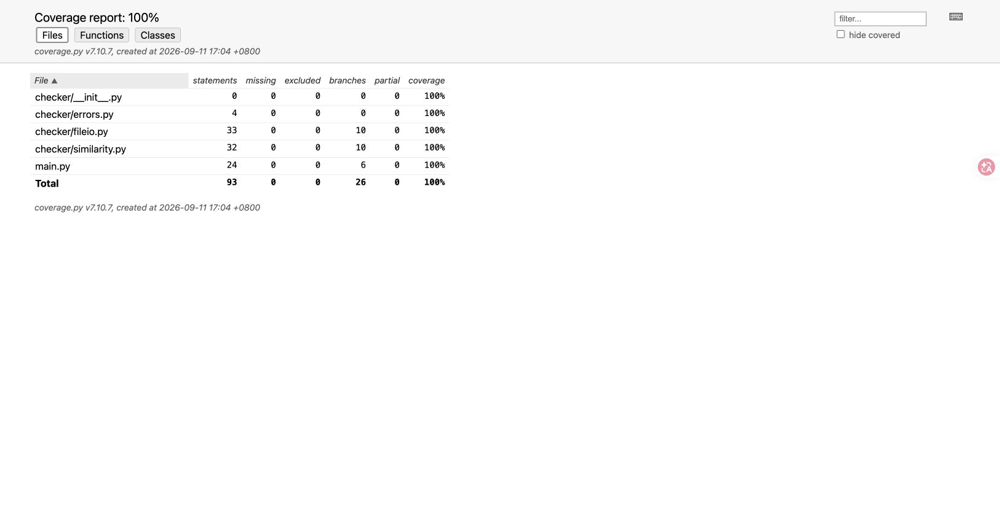

GitHub 作业链接：**待创建仓库并上传后，替换为学号目录的实际链接。**

# 第一次个人编程作业

学号：3224004157。课程作业：[个人项目——论文查重](https://edu.cnblogs.com/campus/gdgy/Class56-Grade2024-CS/homework/15693)。

## 一、项目目标与开发准备

本项目实现一个 Python 命令行程序，接收原文、待比较文本和答案文件三个绝对路径，在答案文件中写入保留两位小数的重复率。入口文件为 `main.py`，运行时只使用标准库。

开发前先记录 PSP 预估，随后按基本功能、性能测量、优化和报告整理分别提交。初版开发时尚未连接远端仓库，提交先保存在本地。

目前使用自建文本进行测试，拿到班级群样例后再补充验证。

## 二、计算模块的设计与实现

程序由命令行入口、文件读写层、相似度计算层和异常类组成：

| 接口 | 作用 |
| --- | --- |
| `main(argv)` | 检查三个参数，处理帮助和错误退出 |
| `compare_files(original, candidate, output)` | 检查路径、保护输入、读写指定文件 |
| `normalize_text(text)` | 统一全角/大小写、过滤空白与标点 |
| `cosine_similarity(left, right)` | 计算两个频数向量的余弦相似度 |
| `similarity(left, right)` | 提取单字符/双字符特征并加权 |

核心流程为：路径校验 → UTF-8 读取 → 文本标准化 → 字符片段频数统计 → 余弦计算 → 写入两位小数。

相邻双字符特征能保留部分局部语序。例如“论文查重”分成“论文”“文查”“查重”。分别计算单字符和双字符余弦相似度，再使用 `0.3 × 单字符余弦 + 0.7 × 双字符余弦` 得到 0～1 的得分。

任一文本清洗后为空时返回 0；只有一个字符时采用单字符项。权重是本项目公开的设计选择，并未经过教师样例调参。该方法不依赖中文分词词典，运行时不联网，特征提取的时间随输入长度线性增长。

这种方法主要比较文字和局部语序，对同义改写的识别能力有限；频数分布相近的文章也可能得到较高分数。

## 三、性能瓶颈与改进

初版为余弦计算建立特征并集和两个补零列表。cProfile 显示该函数两次调用累计约 0.08593 秒，字典查找调用达到 289,632 次。

优化后，点积只遍历较小的频数字典，范数分别遍历已有频数，消除额外并集和稠密列表。公式保持不变。

在相同种子的 120,000 与 126,000 字符自建中文输入上：

| 指标 | 初版 | 优化后 |
| --- | ---: | ---: |
| 核心计算中位耗时（5 次） | 0.103169 秒 | 0.062176 秒 |
| Python 分配峰值 | 48.49 MiB | 28.49 MiB |
| 含进程启动/文件读写的命令行中位耗时 | 0.135066 秒 | 0.092911 秒 |
| 得分 | 0.875756509005383 | 0.875756509005383 |

优化后的函数图来自实际运行的 cProfile 文件和 SnakeViz：


优化后，余弦计算累计约 0.02593 秒；自耗时最大的函数变成频数统计使用的 `_collections._count_elements`，约 0.02214 秒。图上的追踪耗时包含分析工具开销，与未开启分析工具的计时分开统计。

另一组原文 100 万字符、待比较文本 105 万字符的实际命令行检查耗时约 0.764 秒，最大常驻内存约 300 MiB。该结果只代表这台电脑和这组自建输入，不代表老师的隐藏测试。

页面对性能图工具的表述需要确认：这里使用的是 Python cProfile/SnakeViz，尚未确认是否可以替代 VS 2017/JProfiler。

## 四、单元测试与覆盖率

优化后执行 52 项测试全部通过，覆盖正常输入、边界条件、异常分支和真实命令行调用。固定随机种子的额外检查验证相似度对称性、范围和优化前后公式等价性。

一个可以手算预期值的例子：`abc` 与 `abd` 的单字符余弦为 2/3，双字符余弦为 1/2，所以加权结果为 0.55：

```python
def test_hand_calculated_weighted_score(self):
    self.assertAlmostEqual(similarity("abc", "abd"), 0.55)
```

程序运行时代码共 93 条可执行语句、26 个分支，行与分支覆盖率均为 100%。覆盖范围不包括测试自身和开发工具，覆盖率也不能代替算法准确性评估。



Ruff 代码规则检查和格式检查通过。完整原始输出保存在 `reports/tests.txt`、`coverage-summary.txt`、`quality.txt`。

## 五、异常处理

| 异常 | 设计目标 | 一个对应测试 |
| --- | --- | --- |
| `InvalidPathError` | 拒绝相对路径，阻止答案覆盖输入 | `test_answer_cannot_overwrite_original` |
| `TextReadError` | 清晰说明文件缺失、无效 UTF-8 或读取失败 | `test_invalid_utf8_does_not_replace_previous_answer` |
| `ResultWriteError` | 说明输出父目录不存在或没有写入权限 | `test_output_parent_must_exist` |

下面的编码异常测试还验证失败时保留旧答案，避免错误输入导致已有结果被覆盖：

```python
def test_invalid_utf8_does_not_replace_previous_answer(self):
    self.candidate.write_bytes(b"\xff\xfe\x00\x00")
    self.output.write_text("previous", encoding="utf-8")
    with self.assertRaises(TextReadError):
        self.compare()
    self.assertEqual(self.output.read_text(), "previous")
```

## 六、PSP 与过程记录

| PSP2.1 | 开发阶段 | 预估耗时（分钟） | 本轮实际耗时（分钟） |
| --- | --- | ---: | ---: |
| Planning / Estimate | 计划与时间估计 | 5 | 1.20 |
| Development / Analysis | 需求分析 | 5 | 0.49 |
| Development / Design Spec | 设计文档 | 5 | 1.11 |
| Development / Design Review | 设计复审 | 2 | 0.38 |
| Development / Coding Standard | 代码规范 | 2 | <0.01 |
| Development / Design | 具体设计 | 5 | 1.71 |
| Development / Coding | 编码与性能改进 | 20 | 5.05 |
| Development / Code Review | 代码复审 | 5 | 0.02 |
| Development / Test | 测试与验证 | 15 | 2.67 |
| Reporting / Test Report | 测试报告 | 5 | 6.61 |
| Reporting / Size Measurement | 工作量统计 | 1 | <0.01 |
| Reporting / Postmortem | 总结与改进计划 | 5 | 1.16 |
| 合计 |  | 75 | 20.40 |

本表是工具辅助开发过程的阶段计时，统计口径和原始记录见 [PSP 文档](PSP.md)。个人学习、复现和修改的时间待补充。

## 七、总结与后续工作

将文件读写、异常处理和相似度计算拆开后，可以分别验证每一部分。性能分析也发现了多余的中间列表，优化时只需调整余弦计算，不影响文件接口。后续需要补测老师的样例，并确认 Python 性能图的提交要求。

个人复盘（算法理解、复现中遇到的问题及解决过程）：**待补充。**
