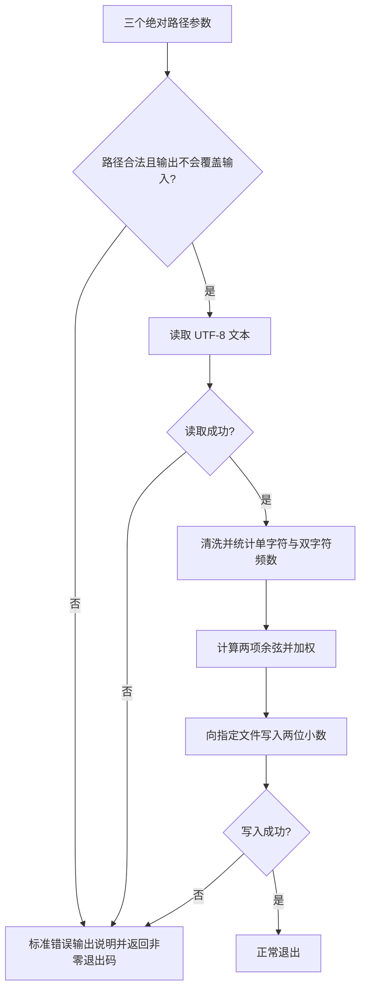

# 设计说明

## 需求与边界

- 输入：三个命令行参数，依次是原文、待比较文本、结果文件的绝对路径。
- 输出：结果文件只包含一个保留两位小数的数值和换行，例如 `0.85`。
- 运行时使用 Python 标准库，不联网，不加载外部分词词典，只读取两份指定文本并写入指定结果文件。
- 本项目将重复率定义为 **0～1 的文本表面相似度**，不是百分数，也不是对抄袭行为的判定。教师尚未提供指定公式或样例期望值，该约定需要在获得样例后核对。
- 输入文件采用 UTF-8（接受 UTF-8 BOM）。其他编码给出明确错误，不静默丢弃字符。
- 忽略标点、空白和大小写，统一 Unicode 兼容字符，例如全角英文字母。
- 两篇文本任一篇清洗后为空时返回 `0.00`；无有效文字不能提供重复证据。

## 算法

1. 用 `unicodedata.normalize("NFKC", text).casefold()` 统一字符表示。
2. 保留 Unicode 字母和数字，得到清洗文本。
3. 分别统计单字符和相邻双字符的频数。例如“论文查重”的双字符为“论文”“文查”“查重”。
4. 对两个频数向量计算余弦相似度：

   `cos(A,B) = Σ(Aᵢ×Bᵢ) / (√ΣAᵢ² × √ΣBᵢ²)`

5. 正常文本的最终得分为 `0.3 × 单字符余弦 + 0.7 × 双字符余弦`。单字符项保留部分词序调整后的相似性；双字符项强调局部连续内容。0.3/0.7 是公开的设计权重，未经教师样例调参。
6. 任一清洗文本只有一个字符时只计算单字符项。将浮点舍入误差限制在 `[0,1]`，写文件时再保留两位小数。

不使用全篇动态规划对齐，避免长文章的二次方时间/空间开销。特征提取时间随文字数线性增长；频数向量空间随不同字符片段数增长。

## 局限

- 不能理解同义改写或深层语义。
- 余弦相似度关注分布，完全重复拼接同一内容也可能得到接近 1 的结果。
- 忽略标点与空白会让排版差异不影响结果，也会丢失部分语言边界信息。
- 权重和相似度数值没有经过真实语料标定，不能保证与老师隐藏测试使用的判定方式一致。

## 模块与接口

| 文件 | 接口 | 责任 |
| --- | --- | --- |
| `main.py` | `main(argv=None)` | 检查参数数量、显示帮助和错误信息、返回退出码 |
| `checker/similarity.py` | `normalize_text(text)` | 字符标准化和过滤 |
| `checker/similarity.py` | `cosine_similarity(left, right)` | 两个频数向量的余弦计算 |
| `checker/similarity.py` | `similarity(left, right)` | 清洗、提取特征、汇总最终得分 |
| `checker/fileio.py` | `compare_files(original, candidate, output)` | 路径保护、读取文本、计算、写答案 |
| `checker/errors.py` | `CheckerError` 及子类 | 将参数/读取/写入失败分类 |
| `tests/` | 单元测试、命令行测试 | 正常、边界、异常和输入文件保护验证 |
| `tools/` | 性能验证工具 | 仅开发时运行，生成自建负载与分析报告 |

## 数据流

## 质量与性能验证计划

- 使用 `unittest`，保证不安装额外依赖也能运行基础测试。
- 覆盖完全相同、完全不同、增删改、标点、全角、英文、数字、空文本、单字符及真实文件调用。
- 通过 `coverage --branch` 检查分支覆盖率，通过 Ruff 检查约定的代码规则。
- 初版采用直观的并集/稠密向量余弦计算；先实际测量，再判断是否应减少中间向量和重复遍历。
- 性能分析使用真实执行的 `cProfile` 数据；计时用独立的 `perf_counter` 多次测量，内存单独使用 `tracemalloc`，避免把分析工具开销当作程序耗时。

## 代码规范

- Python 3.9+，PEP 8 风格，UTF-8 编码，每行不超过 100 字符。
- 公共函数具有类型标注和说明；命名采用 `snake_case`，异常类采用 `PascalCase`。
- 禁止静默吞掉文件错误、访问网络、在导入时执行比较任务。
- 开发工具的报告写入与被测程序的三文件读写职责分开。
