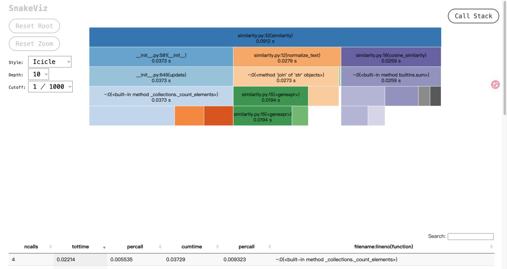

# 性能改进报告

## 真实测量方法

本轮在 macOS 26.5.2 / arm64 / Python 3.9.6 上测量。所有负载均为固定种子 3224004157 生成的自建中文数据，原文 120,000 字符、待比较文本 126,000 字符。两次测量的输入 SHA-256 完全一致。

- 初版：Git 提交 `15d1de1`；测量工具和初版记录：`a9af0f9`。
- 优化后的核心实现：`bf9e75a`。
- 核心耗时：一次预热后独立运行五次，报告中位数。
- 命令行耗时：独立启动进程三次，包含启动、读取两份文本和输出答案。
- 内存：单独运行 tracemalloc，统计新增 Python 分配峰值；不等于整个进程的 RSS。
- cProfile 另行执行，生成函数调用与耗时数据，不混入正常计时。

## 发现的瓶颈

初版的 `cosine_similarity` 先创建特征并集，再构造两个补零的列表。初版分析中，该函数两次调用累计约 0.08593 秒；字典 `get` 被调用 289,632 次，自耗时约 0.02937 秒，是该次分析中自耗时最大的函数。

优化保留同一个余弦公式，直接遍历较小的频数字典计算点积，两个范数分别遍历已有频数。不再创建特征并集和补零列表。

## 前后对比

| 指标 | 初版 | 优化后 |
| --- | ---: | ---: |
| 核心计算中位耗时 | 0.103169 秒 | 0.062176 秒 |
| Python 分配峰值 | 48.49 MiB | 28.49 MiB |
| 实际命令行中位耗时 | 0.135066 秒 | 0.092911 秒 |
| 相似度（未格式化） | 0.875756509005383 | 0.875756509005383 |

在这组输入中，核心计算耗时下降约 **39.7%**，Python 分配峰值下降约 **41.2%**。数学公式没有改变；新增 100 组随机频数向量与独立稠密参考公式比较，结果在 12 位小数精度内一致。

## 性能分析图

以下为真实的 `optimized.prof` 经 SnakeViz 展示后截取的图，并非手工绘制的假分析图：

优化后的分析中，`cosine_similarity` 两次调用累计约 0.02593 秒；字典 `get` 调用减少到 120,200 次。自耗时最多的函数转为频数统计使用的 `_collections._count_elements`，约 0.02214 秒。`normalize_text` 累计约 0.02791 秒，特征统计和清洗成为下一步优化可关注的部分。

图中最上方 `similarity` 的 0.0912 秒包含 cProfile 追踪开销，与正常运行中位数 0.0622 秒不是同一次测量，不应混为一谈。

## 更长输入的独立检查

另使用同一数据生成方式生成原文 1,000,000 字符和待比较文本 1,050,000 字符，实际启动程序一次：

- 退出码：0。
- 包含进程启动、文件读写的总耗时：0.764348 秒。
- 进程最大常驻内存 RSS：300.00 MiB。
- 答案文件：`0.90`。

这次本机检查低于作业规定的 5 秒和 2048 MB，但仍不代表未知输入、其他设备或老师的隐藏测试一定满足限制。

## 原始材料与复现

- [初版全部数据](../reports/performance/baseline.json)
- [优化后全部数据](../reports/performance/optimized.json)
- [初版函数统计](../reports/performance/baseline-profile.txt)
- [优化后函数统计](../reports/performance/optimized-profile.txt)
- [百万字压力测试](../reports/performance/stress.json)
- `reports/performance/baseline.prof` 与 `optimized.prof`：原始 cProfile 文件。

复现方式见项目 README。当前性能脚本运行的是当前代码；复现初版应检出 `a9af0f9`，使用相同 Python 与相同参数，不能仅将优化版运行标签改为 baseline 就声称是初版数据。

题目允许 Python，但图表要求点名 VS 2017/JProfiler，因此本项目的 Python 分析图是否被课程认可仍待确认。
